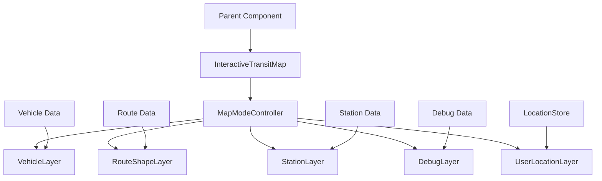

# Design Document

## Overview

The Interactive Transit Map component is a React-based mapping solution built on Leaflet and React-Leaflet. It provides multiple display modes for visualizing real-time transit data including vehicles, routes, stations, and debugging information. The component is designed to be flexible, performant, and integrate seamlessly with the existing Zustand-based state management and Material-UI design system.

## Architecture

### Component Hierarchy

```
InteractiveTransitMap (Main Container)
├── MapContainer (React-Leaflet)
├── MapModeController (Mode Management)
├── VehicleLayer (Vehicle Markers)
├── RouteShapeLayer (Route Lines)
├── StationLayer (Station Markers)
├── DebugLayer (Debug Lines & Labels)
├── UserLocationLayer (User Position)
└── MapControls (UI Controls)
```

### Data Flow



## Components and Interfaces

### Core Component Interface

```typescript
interface InteractiveTransitMapProps {
  // Display mode configuration
  mode: MapMode;
  
  // Data props based on mode
  vehicles?: TranzyVehicleResponse[];
  routes?: TranzyRouteResponse[];
  stations?: TranzyStopResponse[];
  routeShapes?: Map<string, RouteShape>;
  trips?: TranzyTripResponse[];
  stopTimes?: TranzyStopTimeResponse[];
  
  // Target entities for specific modes
  targetVehicleId?: number;
  targetRouteId?: number;
  targetStationId?: number;
  
  // Debug configuration
  debugMode?: boolean;
  debugData?: DebugVisualizationData;
  
  // Visual configuration
  vehicleColorStrategy?: VehicleColorStrategy;
  colorScheme?: Partial<MapColorScheme>;
  
  // Map configuration
  initialCenter?: Coordinates;
  initialZoom?: number;
  showUserLocation?: boolean;
  
  // Event handlers
  onVehicleClick?: (vehicle: TranzyVehicleResponse) => void;
  onStationClick?: (station: TranzyStopResponse) => void;
  onRouteClick?: (route: TranzyRouteResponse) => void;
}

enum MapMode {
  VEHICLE_TRACKING = 'vehicle_tracking',
  ROUTE_OVERVIEW = 'route_overview',
  STATION_CENTERED = 'station_centered'
}
```

### Layer Components

#### VehicleLayer
```typescript
interface VehicleLayerProps {
  vehicles: TranzyVehicleResponse[];
  routes: Map<number, TranzyRouteResponse>;
  onVehicleClick?: (vehicle: TranzyVehicleResponse) => void;
  highlightedVehicleId?: number;
  colorStrategy?: VehicleColorStrategy;
  colorScheme: MapColorScheme;
}
```

#### RouteShapeLayer
```typescript
interface RouteShapeLayerProps {
  routeShapes: Map<string, RouteShape>;
  routes: Map<number, TranzyRouteResponse>;
  highlightedRouteIds?: number[];
  showDirectionArrows?: boolean;
}
```

#### StationLayer
```typescript
interface StationLayerProps {
  stations: TranzyStopResponse[];
  stationTypes?: Map<number, StationSymbolType>;
  onStationClick?: (station: TranzyStopResponse) => void;
  highlightedStationId?: number;
}

enum StationSymbolType {
  DEFAULT = 'default',
  USER_LOCATION = 'user_location',
  TERMINUS = 'terminus',
  NEARBY = 'nearby'
}
```

#### DebugLayer
```typescript
interface DebugLayerProps {
  debugData: DebugVisualizationData;
  visible: boolean;
}

interface DebugVisualizationData {
  vehiclePosition: Coordinates;
  targetStationPosition: Coordinates;
  vehicleProjection: ProjectionResult;
  stationProjection: ProjectionResult;
  routeShape: RouteShape;
  distanceCalculation: DistanceResult;
}
```

## Data Models

### Map State Management

```typescript
interface MapState {
  mode: MapMode;
  center: Coordinates;
  zoom: number;
  bounds?: LatLngBounds;
  
  // Layer visibility
  showVehicles: boolean;
  showRouteShapes: boolean;
  showStations: boolean;
  showUserLocation: boolean;
  showDebugInfo: boolean;
  
  // Selection state
  selectedVehicleId?: number;
  selectedRouteId?: number;
  selectedStationId?: number;
}
```

### Performance Optimization Models

```typescript
interface MapPerformanceConfig {
  maxVehicleMarkers: number;
  maxRouteShapes: number;
  clusteringThreshold: number;
  updateThrottleMs: number;
  renderDistance: number; // Only render items within viewport + buffer
}
```

### Color Management

```typescript
interface MapColorScheme {
  routes: Map<number, string>; // Route ID to color mapping
  vehicles: {
    default: string;
    selected: string;
    lowConfidence: string;
    byRoute: Map<number, string>; // Vehicle color matches its route
  };
  stations: {
    default: string;
    userLocation: string;
    terminus: string;
    nearby: string;
  };
  debug: {
    distanceLine: string;
    projectionLine: string;
    routeShape: string;
  };
}

// Vehicle coloring strategy
enum VehicleColorStrategy {
  BY_ROUTE = 'by_route',     // Vehicle color matches its route color
  BY_CONFIDENCE = 'by_confidence', // Vehicle color indicates arrival confidence
  UNIFORM = 'uniform'        // All vehicles use same color
}
```

## Correctness Properties

*A property is a characteristic or behavior that should hold true across all valid executions of a system-essentially, a formal statement about what the system should do. Properties serve as the bridge between human-readable specifications and machine-verifiable correctness guarantees.*

Now I need to analyze the acceptance criteria to determine which ones can be tested as properties:

<function_calls>
<invoke name="prework">
<parameter name="featureName">interactive-transit-map

Based on the prework analysis, I can consolidate the testable properties to eliminate redundancy:

### Property 1: Vehicle Marker Accuracy
*For any* vehicle with valid coordinates, the map should display a vehicle marker at the exact GPS position and update the marker position when coordinates change
**Validates: Requirements 1.1, 1.4**

### Property 2: Route Shape Display Completeness
*For any* route shape data provided to the map, all route shapes should be rendered as colored lines with appropriate styling for different routes and directions
**Validates: Requirements 1.2, 2.1, 2.2, 2.4, 3.2, 3.4**

### Property 3: Station Marker Display Accuracy
*For any* set of stations provided to the map, all stations should be displayed as markers at their correct coordinates with appropriate symbol types
**Validates: Requirements 1.3, 2.3, 3.1, 3.3**

### Property 4: Viewport Management
*For any* map mode and target entities, the map viewport should be positioned to optimally display all relevant elements within the visible bounds
**Validates: Requirements 1.5, 2.5, 3.5**

### Property 5: Debug Visualization Completeness
*For any* debug data when debug mode is enabled, all debug lines (distance, projection) should be rendered with distinct colors and distance labels
**Validates: Requirements 4.1, 4.2, 4.3, 4.4, 4.5**

### Property 6: User Location Display
*For any* valid user location data, the user location marker should be displayed at the correct coordinates and provide centering functionality
**Validates: Requirements 5.1, 5.2, 5.5**

### Property 7: Error Handling Robustness
*For any* invalid or missing location data, the map should handle the absence gracefully without throwing errors
**Validates: Requirements 5.3**

### Property 8: Interactive Controls Functionality
*For any* interactive element (markers, controls), clicking should trigger appropriate handlers and display relevant information
**Validates: Requirements 6.2, 6.3, 6.4**

### Property 9: Station Symbol Customization
*For any* station with specified symbol type and styling, the map should render the appropriate symbol variant with custom colors and sizes
**Validates: Requirements 7.1, 7.2, 7.3, 7.4**

### Property 10: Loading State Display
*For any* data fetching operation, the map should display appropriate loading states during the operation
**Validates: Requirements 8.5**

## Error Handling

### Location Services Integration
- Graceful handling of missing GPS permissions
- Fallback behavior when user location is unavailable
- Error boundaries for map rendering failures

### Data Validation
- Coordinate validation for all geographic data
- Null/undefined checks for optional data props
- Type safety for all map layer data

### Performance Safeguards
- Maximum marker limits to prevent browser freezing
- Throttled updates for real-time data
- Memory cleanup for removed map elements

## Testing Strategy

### Unit Testing Approach
- **Component Testing**: Test individual layer components in isolation
- **Integration Testing**: Test component interactions and data flow
- **Error Boundary Testing**: Verify graceful error handling
- **Mock Testing**: Use mock Leaflet instances for consistent testing

### Property-Based Testing Configuration
- **Testing Library**: Fast-check for property-based testing
- **Test Iterations**: Minimum 100 iterations per property test
- **Data Generation**: Custom generators for transit data structures
- **Test Environment**: jsdom with mock Leaflet map instance

### Test Data Generators
```typescript
// Custom generators for property-based testing
const generateVehicle = (): TranzyVehicleResponse => ({
  id: fc.integer({ min: 1, max: 10000 }),
  latitude: fc.float({ min: 46.7, max: 46.8 }), // Cluj bounds
  longitude: fc.float({ min: 23.5, max: 23.7 }),
  // ... other required fields
});

const generateRouteShape = (): RouteShape => ({
  shape_id: fc.string(),
  points: fc.array(generateCoordinates(), { minLength: 2, maxLength: 50 }),
  // ... other required fields
});
```

### Performance Testing
- **Load Testing**: Test with large datasets (1000+ vehicles, 100+ routes)
- **Memory Testing**: Monitor memory usage during extended use
- **Render Testing**: Measure rendering performance for different zoom levels

### Visual Regression Testing
- **Screenshot Testing**: Capture map renders for visual comparison
- **Marker Testing**: Verify marker appearance and positioning
- **Color Testing**: Ensure consistent color schemes across modes

### Vehicle Coloring Strategy

**Default Behavior**: Vehicles will be colored according to their route by default (`VehicleColorStrategy.BY_ROUTE`). This provides visual consistency where:
- All vehicles on the same route share the same color as their route shape
- Different routes have distinct colors for easy identification
- Selected vehicles get highlighted with a special selection color overlay

**Alternative Strategies**:
- `BY_CONFIDENCE`: Color vehicles based on arrival time confidence (high=green, medium=yellow, low=red)
- `UNIFORM`: All vehicles use the same color (useful for minimalist displays)

This ensures visual coherence between route shapes and their associated vehicles, making it easy for users to understand which vehicles belong to which routes.