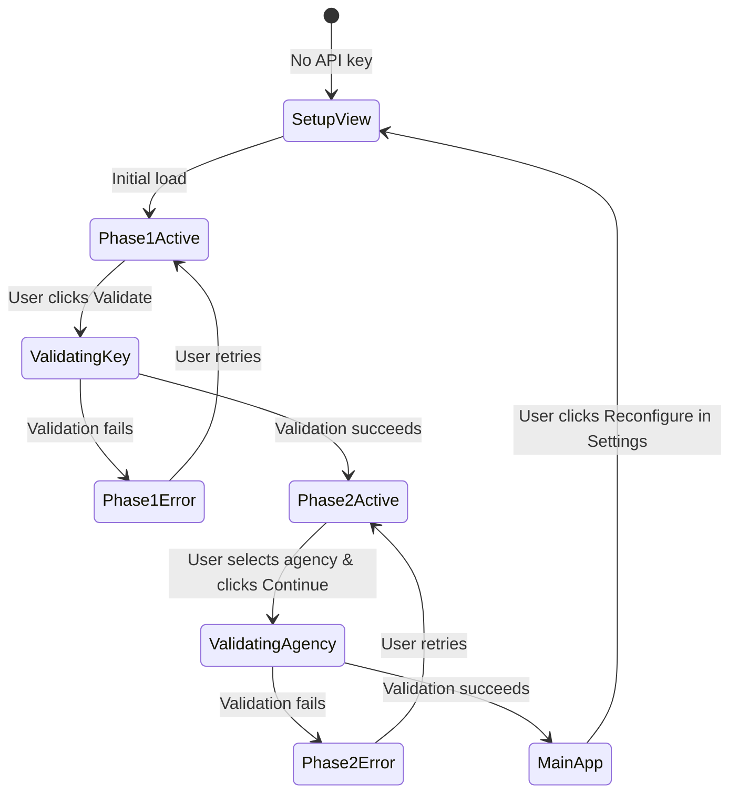

# Design Document

## Overview

This design restructures the initial setup experience by consolidating API key validation and agency selection into a single, unified two-phase view. The current implementation splits these concerns between the ApiKeySetupView and SettingsView, creating a fragmented user experience. The new design presents both phases in a single view with clear visual progression, while simplifying the SettingsView to focus on configuration management.

The key architectural changes include:
- Transforming ApiKeySetupView into a two-phase setup flow with both API key and agency selection
- Removing agency selection from SettingsView and replacing it with a simple "Reconfigure" button
- Maintaining the existing state management patterns in configStore and agencyStore
- Preserving the navigation blocking behavior during incomplete setup

## Architecture

### Component Structure

```
SetupView (view -1)
├── Phase 1: API Key Entry
│   ├── API Key TextField (password type)
│   ├── Validate Button
│   └── Error Alert (conditional)
└── Phase 2: Agency Selection
    ├── Agency Dropdown (disabled until Phase 1 completes)
    ├── Continue Button (disabled until agency selected)
    └── Error Alert (conditional)

SettingsView (view 2)
├── Theme Toggle Card
└── Reconfigure Button Card
```

### State Flow



### Data Flow

1. **API Key Validation Flow:**
   - User enters API key → SetupView
   - SetupView calls configStore.validateApiKey()
   - configStore calls agencyService.validateApiKey()
   - On success: configStore saves key, agencyStore caches agencies
   - SetupView enables Phase 2 with populated dropdown

2. **Agency Selection Flow:**
   - User selects agency → SetupView
   - SetupView calls configStore.validateAndSave()
   - configStore calls routeService.validateAgency()
   - On success: configStore saves agency_id, clears old data
   - SetupView navigates to main app (view 0)

3. **Reconfiguration Flow:**
   - User clicks Reconfigure → SettingsView
   - SettingsView navigates to SetupView with pre-filled key
   - SetupView follows normal validation flow
   - On success: Navigate back to main app

## Components and Interfaces

### SetupView Component

**File:** `src/components/features/views/SetupView.tsx` (renamed from ApiKeySetupView.tsx)

**Props:**
```typescript
interface SetupViewProps {
  initialApiKey?: string;      // Pre-fill for reconfiguration
  initialAgencyId?: number;    // Pre-select agency for reconfiguration
  onComplete: () => void;      // Callback after successful setup
}
```

**State:**
```typescript
interface SetupViewState {
  // Phase 1 state
  apiKey: string;
  isKeyModified: boolean;
  keyValidated: boolean;
  
  // Phase 2 state
  selectedAgencyId: number | '';
  
  // UI state
  phase1Loading: boolean;
  phase2Loading: boolean;
  phase1Error: string | null;
  phase2Error: string | null;
}
```

**Key Methods:**
- `handleValidateKey()`: Validates API key and enables Phase 2
- `handleAgencySelect()`: Updates selected agency
- `handleContinue()`: Validates agency and completes setup
- `clearPhase1Error()`: Clears Phase 1 error state
- `clearPhase2Error()`: Clears Phase 2 error state

### SettingsView Component

**File:** `src/components/features/views/SettingsView.tsx`

**Props:**
```typescript
interface SettingsViewProps {
  onNavigateToSetup: () => void;  // Callback to navigate to SetupView
}
```

**Simplified Structure:**
- Theme toggle card (existing)
- Reconfigure button card (new, replaces agency selection and API key management)
- Reserved space for future cache management controls

### Store Interfaces

**configStore** (no changes to interface, only usage patterns):
```typescript
interface ConfigStore {
  validateApiKey: (apiKey: string) => Promise<void>;
  validateAndSave: (apiKey: string, agencyId: number) => Promise<void>;
  clearAgencyData: () => Promise<void>;
  // ... existing fields
}
```

**agencyStore** (no changes):
```typescript
interface AgencyStore {
  agencies: TranzyAgencyResponse[];
  setAgencies: (agencies: TranzyAgencyResponse[]) => void;
  loadAgencies: () => Promise<void>;
  // ... existing fields
}
```

## Data Models

### SetupView Internal State

```typescript
// Phase tracking
type SetupPhase = 'phase1' | 'phase2';

// Validation state for Phase 1
interface Phase1State {
  apiKey: string;
  isModified: boolean;
  isValidated: boolean;
  loading: boolean;
  error: string | null;
}

// Validation state for Phase 2
interface Phase2State {
  selectedAgencyId: number | '';
  loading: boolean;
  error: string | null;
}
```

### Agency Data Model (existing)

```typescript
interface TranzyAgencyResponse {
  agency_id: number;
  agency_name: string;
  agency_url?: string;
  agency_timezone?: string;
  agency_lang?: string;
  agency_phone?: string;
}
```

### Configuration Data Model (existing)

```typescript
interface ConfigData {
  apiKey: string | null;
  agency_id: number | null;
  theme: 'light' | 'dark' | 'auto' | null;
  home_location: { lat: number; lon: number } | null;
  work_location: { lat: number; lon: number } | null;
}
```

## Error Handling

### Phase 1 Error Scenarios

1. **Invalid API Key:**
   - Trigger: API returns 401/403
   - Display: "Invalid API key. Please check your key and try again."
   - Recovery: User can edit and re-validate

2. **Network Error:**
   - Trigger: Network request fails
   - Display: "Network error. Please check your connection and try again."
   - Recovery: User can retry validation

3. **Empty Agency List:**
   - Trigger: API returns empty array
   - Display: "No agencies found for this API key."
   - Recovery: User must enter different key

### Phase 2 Error Scenarios

1. **Invalid Agency Combination:**
   - Trigger: routeService.validateAgency() returns false
   - Display: "This agency is not valid for your API key."
   - Recovery: User can select different agency

2. **Network Error:**
   - Trigger: Network request fails
   - Display: "Network error. Please check your connection and try again."
   - Recovery: User can retry with same selection

### Error Display Pattern

- Errors display as Material-UI Alert components above the relevant section
- Errors auto-clear when user modifies the related input
- Errors include a dismiss button for manual clearing
- Loading states disable inputs and show progress indicators

## Testing Strategy

### Unit Tests

**SetupView Component Tests:**
- Phase 1 enables when API key is entered
- Phase 2 remains disabled until Phase 1 completes
- Validate button triggers API key validation
- Continue button triggers agency validation
- Error messages display correctly for each phase
- Loading states disable inputs appropriately
- Pre-filled values work for reconfiguration flow

**SettingsView Component Tests:**
- Reconfigure button navigates to SetupView
- Theme toggle works correctly
- Agency selection dropdown is removed
- API key management card is removed

**Integration Tests:**
- Complete setup flow from empty state to configured
- Reconfiguration flow with pre-filled values
- Error recovery in both phases
- Navigation blocking during incomplete setup
- Data persistence across page reloads

### Property-Based Tests

Property-based tests will be defined after prework analysis in the Correctness Properties section.


## Correctness Properties

A property is a characteristic or behavior that should hold true across all valid executions of a system—essentially, a formal statement about what the system should do. Properties serve as the bridge between human-readable specifications and machine-verifiable correctness guarantees.

### Property Reflection

After analyzing all acceptance criteria, I identified several areas where properties can be consolidated:

**Redundancy Analysis:**
- Properties 2.3 and 4.1 both test agency list storage after validation → Combine into single property
- Properties 2.4 and 3.1 both test Phase 2 enablement after Phase 1 success → Combine into single property
- Properties 7.2, 7.3, and 7.4 all test navigation blocking based on configuration state → Combine into single comprehensive property
- Properties 9.1 and 9.2 both test localStorage persistence → Combine into single property
- Properties 9.4 and 9.5 both test cache clearing on configuration changes → Combine into single property

### Properties

**Property 1: Phase 2 remains disabled until Phase 1 completes**
*For any* Setup_View state where Phase 1 is incomplete (API key not validated), Phase 2 controls (agency dropdown and Continue button) should remain disabled.
**Validates: Requirements 1.3**

**Property 2: View height consistency**
*For any* Setup_View phase state (Phase 1 active, Phase 2 active, loading, error), the view container height should remain constant to prevent layout shifts.
**Validates: Requirements 1.4**

**Property 3: Validate button enablement**
*For any* non-empty API key input, the Validate button should be enabled; for empty input, it should be disabled.
**Validates: Requirements 2.1**

**Property 4: Phase 2 enablement and population**
*For any* successful API key validation that returns an agency list, Phase 2 should become enabled and the agency dropdown should be populated with all returned agencies.
**Validates: Requirements 2.4, 3.1**

**Property 5: Continue button enablement**
*For any* Setup_View state where an agency is selected, the Continue button should be enabled; when no agency is selected, it should be disabled.
**Validates: Requirements 3.3**

**Property 6: Agency list storage and persistence**
*For any* successful API key validation, the returned agency list should be stored in the Agency_Store and persisted to localStorage.
**Validates: Requirements 2.3, 4.1, 4.2**

**Property 7: Agency list pre-population**
*For any* Setup_View load with a cached agency list in localStorage, the agency dropdown should be pre-populated with the cached agencies.
**Validates: Requirements 4.3**

**Property 8: Cache clearing on API key change**
*For any* API key change (new key different from current key), all agency-specific cached data should be cleared from all stores (agency, route, station, vehicle, trip, stopTime, shape).
**Validates: Requirements 4.4, 9.4**

**Property 9: Cache clearing on agency change**
*For any* agency change (new agency_id different from current agency_id), all agency-specific cached data should be cleared from all stores.
**Validates: Requirements 9.5**

**Property 10: API key masking for reconfiguration**
*For any* existing API key, when Setup_View loads for reconfiguration, the displayed key should be masked showing only the last 4 characters.
**Validates: Requirements 5.2**

**Property 11: Modified key detection**
*For any* pre-filled masked API key, when a user modifies the input, the system should detect the modification and treat the new value as a new key requiring validation.
**Validates: Requirements 5.4**

**Property 12: Navigation blocking based on configuration state**
*For any* app configuration state:
- If API key is null → block navigation to all views except Setup_View (-1)
- If API key exists but agency_id is null → block navigation to views 0 and 1
- If both API key and agency_id exist → allow navigation to all views
**Validates: Requirements 7.2, 7.3, 7.4**

**Property 13: Error clearing on input change**
*For any* input field with an active error message, when the user types in that field, the error message should be cleared.
**Validates: Requirements 8.3**

**Property 14: Input disabling during loading**
*For any* validation operation in progress (Phase 1 or Phase 2), all form inputs should be disabled to prevent concurrent submissions.
**Validates: Requirements 8.5**

**Property 15: Configuration persistence**
*For any* saved configuration (API key and agency_id), the values should be persisted to localStorage and readable on subsequent app loads.
**Validates: Requirements 9.1, 9.2, 9.3**

### Testing Strategy

**Dual Testing Approach:**

This feature requires both unit tests and property-based tests for comprehensive coverage:

**Unit Tests** will verify:
- Initial render shows both Phase 1 and Phase 2 sections (Req 1.1, 1.2)
- Validate button triggers API key validation (Req 2.2)
- Continue button triggers agency validation (Req 3.4)
- Error messages display correctly for validation failures (Req 2.5, 3.6, 8.1, 8.2)
- Enter key triggers validation in API key field (Req 2.6)
- Disabled agency dropdown shows placeholder text (Req 3.2)
- Navigation to Setup_View from Settings works (Req 5.1, 6.4)
- Unmodified pre-filled key uses original value (Req 5.3)
- Settings_View structure is simplified (Req 6.1, 6.2, 6.3)
- Navigation bar is hidden in Setup_View (Req 7.1)
- Loading indicators display during validation (Req 8.4)
- Successful validation triggers navigation (Req 3.5, 5.5)

**Property-Based Tests** will verify:
- All 15 correctness properties listed above
- Each test will run minimum 100 iterations
- Each test will be tagged with: **Feature: unified-setup-flow, Property N: [property text]**

**Property-Based Testing Library:**
- Use **fast-check** for TypeScript/React property-based testing
- Configure each test with `fc.assert(..., { numRuns: 100 })`
- Use custom arbitraries for generating valid API keys, agency lists, and configuration states

**Test Organization:**
- Unit tests: `src/components/features/views/__tests__/SetupView.test.tsx`
- Unit tests: `src/components/features/views/__tests__/SettingsView.test.tsx`
- Property tests: `src/components/features/views/__tests__/SetupView.properties.test.tsx`
- Integration tests: `src/test/integration/setup-flow.test.tsx`
