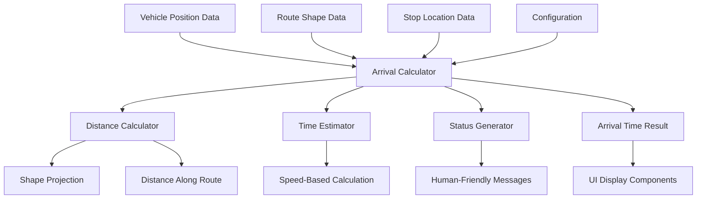

# Design Document: Vehicle Arrival Time

## Overview

The Vehicle Arrival Time feature provides real-time arrival estimates for transit vehicles approaching their next stops. The system calculates accurate time estimates by considering vehicle position, route geometry, and configurable speed parameters. It generates human-friendly status messages and supports both nearby view displays and specific stop queries.

The design prioritizes accuracy by using route shapes (polylines) over straight-line distances, while maintaining performance through efficient geometric calculations and configurable parameters.

## Architecture

### High-Level Architecture



### Core Components

1. **Arrival Calculator**: Main orchestrator that coordinates distance calculation, time estimation, and status generation
2. **Distance Calculator**: Handles geometric calculations along route shapes and fallback distance calculations
3. **Time Estimator**: Converts distances to time estimates using configurable speed parameters
4. **Status Generator**: Creates human-friendly arrival messages based on time and proximity
5. **Configuration Manager**: Manages speed constants, dwell times, and proximity thresholds

## Components and Interfaces

### ArrivalCalculator Interface

```typescript
interface ArrivalCalculator {
  calculateArrivalTime(
    vehicle: Vehicle,
    targetStop: Stop,
    routeShape?: RouteShape
  ): ArrivalTimeResult;
  
  calculateMultipleArrivals(
    vehicles: Vehicle[],
    targetStop: Stop
  ): ArrivalTimeResult[];
  
  sortVehiclesByArrival(results: ArrivalTimeResult[]): ArrivalTimeResult[];
}

interface ArrivalTimeResult {
  vehicleId: string;
  estimatedMinutes: number;
  statusMessage: string;
  confidence: 'high' | 'medium' | 'low';
  calculationMethod: 'route_shape' | 'stop_segments';
}
```

### DistanceCalculator Interface

```typescript
interface DistanceCalculator {
  calculateDistanceAlongShape(
    vehiclePosition: GpsPosition,
    targetStop: Stop,
    routeShape: RouteShape
  ): DistanceResult;
  
  calculateDistanceViaStops(
    vehiclePosition: GpsPosition,
    targetStop: Stop,
    intermediateStops: Stop[]
  ): DistanceResult;
  
  projectPointToShape(
    point: GpsPosition,
    shape: RouteShape
  ): ProjectionResult;
}

interface DistanceResult {
  totalDistance: number;
  method: 'route_shape' | 'stop_segments';
  confidence: 'high' | 'medium' | 'low';
}
```

### Configuration Interface

```typescript
interface ArrivalConfig {
  averageSpeed: number; // km/h
  dwellTime: number; // seconds per intermediate stop
  proximityThreshold: number; // meters for "at stop"
  recentDepartureWindow: number; // minutes for "just left"
  speedValidationRange: {
    min: number; // minimum valid speed (km/h)
    max: number; // maximum valid speed (km/h)
  };
}
```

## Data Models

### Core Data Types

```typescript
interface Vehicle {
  id: string;
  position: GpsPosition;
  speed?: number; // km/h from API if available
  trip: Trip;
  lastUpdated: Date;
}

interface Trip {
  id: string;
  routeId: string;
  stops: TripStop[];
  shape?: RouteShape;
}

interface TripStop {
  stopId: string;
  sequence: number;
  scheduledTime?: Date;
  position: GpsPosition;
}

interface Stop {
  id: string;
  name: string;
  position: GpsPosition;
}

interface RouteShape {
  id: string;
  points: GpsPosition[];
  segments: ShapeSegment[];
}

interface ShapeSegment {
  start: GpsPosition;
  end: GpsPosition;
  distance: number;
}

interface GpsPosition {
  latitude: number;
  longitude: number;
}
```

### Calculation Results

```typescript
interface ProjectionResult {
  closestPoint: GpsPosition;
  distanceToShape: number;
  segmentIndex: number;
  positionAlongSegment: number; // 0-1
}

interface ArrivalTimeResult {
  vehicleId: string;
  estimatedMinutes: number;
  statusMessage: string;
  confidence: 'high' | 'medium' | 'low';
  calculationMethod: 'route_shape' | 'stop_segments';
  rawDistance?: number;
  debugInfo?: {
    vehicleToShapeDistance: number;
    distanceAlongShape: number;
    stopToShapeDistance: number;
    totalCalculatedDistance: number;
  };
}
```

## Correctness Properties

*A property is a characteristic or behavior that should hold true across all valid executions of a system—essentially, a formal statement about what the system should do. Properties serve as the bridge between human-readable specifications and machine-verifiable correctness guarantees.*

<function_calls>
<invoke name="prework">
<parameter name="featureName">vehicle-arrival-time